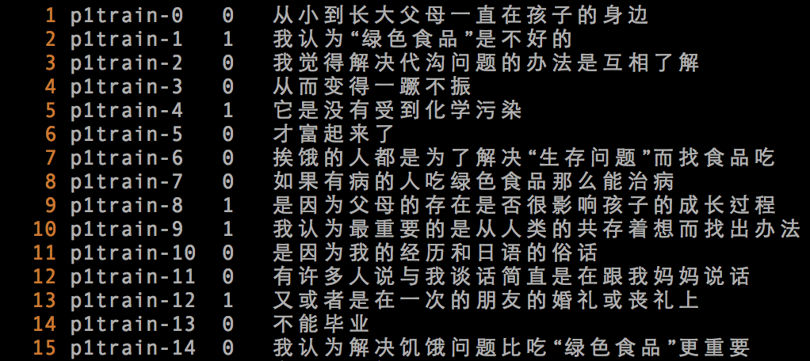

#Phase 1 Presentation

##Our Source Code

+ autorun.sh
+ 240365\_p1.train.txt
+ nlp.py
+ train\_cut.c
+ p1.test.txt
+ llh.py
+ recover.py

##What do they do

|Files|Functionality|
|:----|:-----------|
|autorun.sh|as a autograder?|
|240365\_p1.train.txt|the training data|
|nlp.py|finding pairs?|
|train\_cut.c|from sentences to POS tags?|
|p1.test.txt|the test data|
|llh.py|learning from training data|
|recover.py|add id to answer|

##Usage

####Step1
```sh
python nlp.py | tr -s $'\n' > tmp1.txt
```
####Step2
```sh
gcc -I/usr/local/scws/include/scws -L/usr/local/scws/lib/ train_cut.c -lscws -o a.out
```

####Step3
```sh
./a.out < tmp1.txt | grep -B 1 "===" | grep -E "0|1|POS" > tmp_train.txt
```

####Step4
```sh
cat p1.test.txt | cut -d $'\t' -f 2 > tmp1.txt
```

####Step5
```sh
./a.out < tmp1.txt | grep -B 1 "===" | grep -E "0|1|POS" > tmp_test.txt
```

####Step6
```sh
python llh.py tmp_train.txt tmp_test.txt 2.0 3.0 > tmp_result.txt
```

####Step7
```sh
python recover.py > p1.result.txt
```

####Step8
```sh
rm -f a.out tmp1.txt tmp_result.txt tmp_test.txt tmp_train.txt
```



